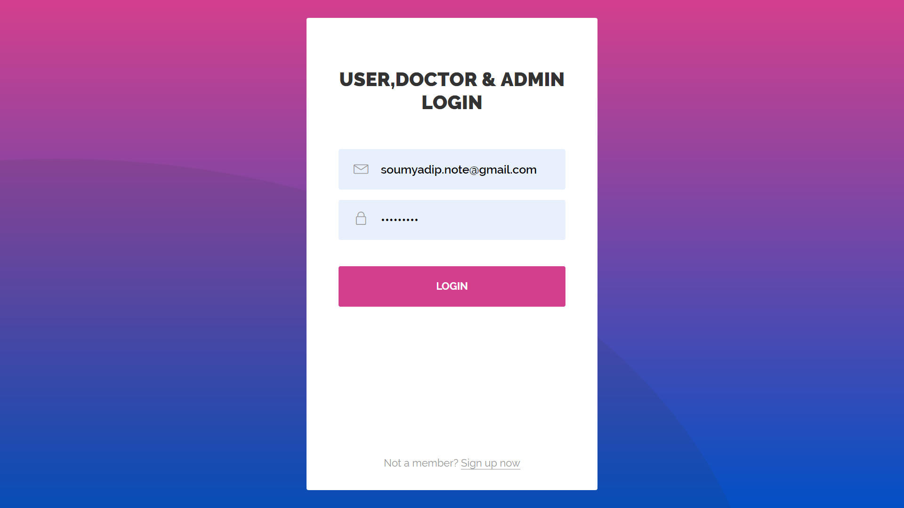
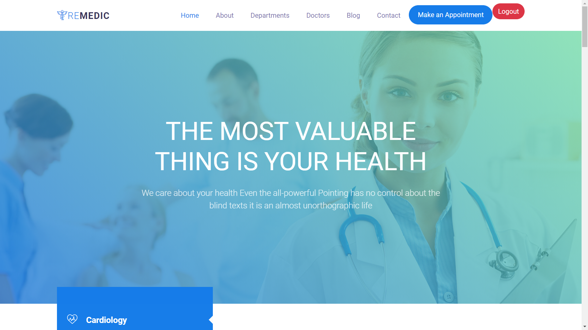
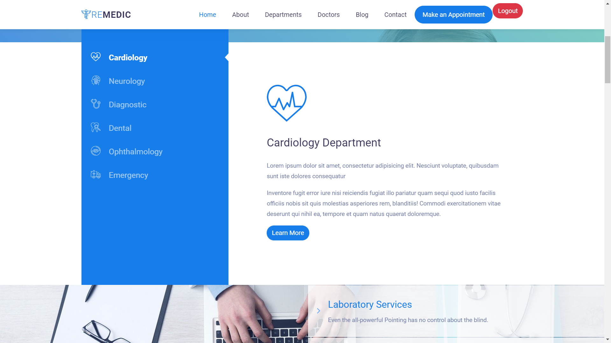

# 🏥 Web-Based Centralized Healthcare Portal

A web-based **Hospital Management System (HMS)** developed using **Java, Spring Boot, MySQL, Thymeleaf, HTML, CSS, JavaScript, and Bootstrap**.

The application is designed to centralize and simplify hospital operations such as patient management, doctor management, appointment scheduling, medical records, and billing.

---

## 📌 Project Overview

The **Web-Based Centralized Healthcare Portal** provides a centralized platform for managing healthcare-related activities through three main modules:

- 👨‍💼 **Admin**
- 👨‍⚕️ **Doctor**
- 🧑‍💻 **User / Patient**

The system is intended to reduce manual processes and provide a convenient interface for patients, doctors, and administrators.

---

## ✨ Key Features

### 👨‍💼 Admin Module

- Manage doctors and patients
- Manage user accounts
- Manage hospital-related information
- Monitor appointments and hospital activities
- Access administrative information and reports

### 👨‍⚕️ Doctor Module

- View appointment schedules
- Manage patient information
- Access patient medical records
- Update treatment-related information
- Manage doctor profile and availability

### 🧑‍💻 User / Patient Module

- User registration and login
- Manage personal profile
- View available doctors
- Book appointments
- View appointment information
- Access available medical information
- Manage healthcare-related activities through the portal

### 🏥 Healthcare Management

- Patient management
- Doctor management
- Appointment scheduling
- Medical record management
- Billing management
- Hospital resource management
- Role-based user modules

---

## 🛠️ Technologies Used

| Technology | Purpose |
|---|---|
| **Java** | Application development |
| **Spring Boot** | Backend framework |
| **Thymeleaf** | Server-side HTML rendering |
| **HTML5** | Web page structure |
| **CSS3** | Styling and layout |
| **JavaScript** | Client-side interactivity |
| **Bootstrap** | Responsive UI |
| **MySQL** | Relational database |
| **Maven** | Dependency and build management |
| **Git & GitHub** | Version control |
| **Apache Tomcat** | Application server/runtime |

---

## 🏗️ Project Structure

```text
Web-Based-Centralized-Healthcare-Portal
│
├── .mvn/
│   └── wrapper/
│
├── img/
│
├── src/
│   ├── main/
│   │   ├── java/
│   │   │   └── com.spring.bioMedical/
│   │   │       ├── config/
│   │   │       ├── Controller/
│   │   │       ├── entity/
│   │   │       ├── repository/
│   │   │       ├── service/
│   │   │       └── BioMedicalApplication.java
│   │   │
│   │   └── resources/
│   │       ├── static/
│   │       ├── templates/
│   │       └── application.properties
│   │
│   └── test/
│
├── Dockerfile
├── mvnw
├── mvnw.cmd
├── pom.xml
└── .gitignore
```

---

## 🗄️ Database

The application uses **MySQL** as its relational database.

The database is used to store structured healthcare information such as:

- Patient information
- Doctor information
- Appointment details
- Medical records
- Billing information
- User information

---

## 🔄 System Workflow

```text
                    ┌──────────────────────┐
                    │   Web Application     │
                    └──────────┬───────────┘
                               │
              ┌────────────────┼────────────────┐
              │                │                │
              ▼                ▼                ▼
        ┌──────────┐     ┌──────────┐     ┌────────────┐
        │  Admin   │     │  Doctor  │     │ User/Patient│
        └────┬─────┘     └────┬─────┘     └─────┬──────┘
             │                │                  │
             └────────────────┼──────────────────┘
                              ▼
                    ┌────────────────────┐
                    │   Spring Boot      │
                    │  Business Logic    │
                    └─────────┬──────────┘
                              │
                              ▼
                    ┌────────────────────┐
                    │       MySQL        │
                    │      Database      │
                    └────────────────────┘
```

---

## 📅 Appointment Management

The system supports appointment-related workflows between patients and doctors.

```text
Patient
   ↓
Login / Registration
   ↓
Select Doctor
   ↓
View Available Appointment
   ↓
Book Appointment
   ↓
Appointment Management
   ↓
Doctor / Admin
```

---

## ▶️ Project Working Demo

### 🎥 Watch the Complete Project Demo

The following video demonstrates the working application and its major healthcare management functionalities.

**Project Demo Video:**

[▶️ Open the Project Demo Video](https://github.com/user-attachments/assets/9e0ffda7-5918-4cac-a92c-61b87a732316)

---

## 📸 Screenshots

Application screenshots can be found in the [`img`](./img) directory.

You can add selected screenshots here as the project is documented further.

Example:

```markdown



```

---

## ▶️ How to Run the Project

### Prerequisites

Make sure the following are installed:

- Java / JDK
- IntelliJ IDEA or another Java IDE
- MySQL
- MySQL Workbench
- Maven
- Git

### 1. Clone the Repository

```bash
git clone https://github.com/Madhu-shree-R/Web-Based-Centralized-Healthcare-Portal.git
```

### 2. Open the Project

Open the cloned project in IntelliJ IDEA.

### 3. Create the Database

Create the MySQL database:

```sql
CREATE DATABASE Hospital_management;
```

### 4. Configure Application Properties

The project uses environment variables for sensitive credentials.

Configure the required environment variables in your IDE/runtime, for example:

```text
DB_USERNAME=your_mysql_username
DB_PASSWORD=your_mysql_password
MAIL_USERNAME=your_email
MAIL_PASSWORD=your_email_app_password
```

**Do not commit real passwords, API keys, or email credentials to GitHub.**

### 5. Run the Application

Run:

```text
BioMedicalApplication.java
```

Or use Maven:

```bash
./mvnw spring-boot:run
```

On Windows:

```bash
mvnw.cmd spring-boot:run
```

### 6. Open the Application

After Spring Boot starts successfully, open the application URL shown in the console.

---

## 🔐 Configuration & Security

Sensitive configuration values such as:

- Database username/password
- Email credentials
- API keys or other secrets

should be supplied through environment variables and should not be stored directly in the GitHub repository.

The repository includes a `.gitignore` file to prevent local and generated files from being committed.

---

## 🚀 Future Enhancements

Potential future improvements include:

- Online payment gateway integration
- Real-time notifications
- Telemedicine/video consultation
- Laboratory system integration
- Pharmacy management integration
- Advanced reporting and analytics
- Mobile application support
- Additional security enhancements
- AI-assisted healthcare analytics

---

## 📚 Project Documentation

The project documentation covers the project objectives, modules, problem definition, proposed solution, technologies, workflow, database, implementation concepts, and future enhancements.

---

## 👩‍💻 Developer

**Madhushree R**

GitHub:  
https://github.com/Madhu-shree-R

---

## ⭐ Acknowledgement

This project was developed as a web-based Hospital Management System to demonstrate the use of **Java, Spring Boot, MySQL, Thymeleaf, JavaScript, HTML, CSS, and Bootstrap** in building a centralized healthcare management application.
